<div align="center">

<!-- ================= 1. CINEMATIC HEADER ================= -->


<br/>

<!-- ================= 2. LIVE SYSTEM TELEMETRY PILLS ================= -->
<p align="center">
  
  &nbsp;
  
  &nbsp;
  
  &nbsp;
  
  &nbsp;
  
</p>

<br/>

<!-- ================= 3. TYPING ANIMATION ================= -->


<br/><br/>

---

<!-- ================= 4. THE CIPHER STACK ================= -->
<h3><code>The Cipher Stack</code></h3>

<table>
  <tr>
    <td valign="top" align="center">
      
    </td>
    <td valign="top" width="490">

```yaml
# ══════════════════════════════════════
#   SYSTEM :: IDENTITY MANIFEST v2.0
# ══════════════════════════════════════

operator     : "Rajiv G. Ramteke"
handle       : "@rajiv-ramteke"
clearance    : LEVEL-07 // ROOT
node         : Nagpur, Maharashtra 🇮🇳

# ── EDUCATION ──────────────────────
degree       : "B.Tech Computer Engineering"
year         : "3rd Year Undergrad"
university   : "Nagpur, Maharashtra"

# ── MISSION & FOCUS ────────────────
objective    : "Scalable Full Stack + AI Systems"
strengths    :
  - "System Architecture & API Design"
  - "Computer Vision & ML Pipelines"
  - "Deep Debugging & Code Optimization"

# ── STATUS & DISPATCH ──────────────
availability : "Open to Opportunities ✅"
contact      : "ramtekerajiv22@gmail.com"
github       : "github.com/rajiv-ramteke"
```

  </td>
  </tr>
</table>

<br/>

<!-- ================= 5. TERMINAL DIRECTIVE (ABOUT OPERATOR) ================= -->
<table align="center" width="100%">
  <tr>
    <td style="background-color: #020617; border: 1.5px solid #00f3ff; border-radius: 12px; padding: 22px; box-shadow: 0 0 25px rgba(0, 243, 255, 0.2), inset 0 0 20px rgba(2, 6, 23, 0.9);">
      <p align="left" style="font-family: 'Courier New', Courier, monospace; color: #00f3ff; margin: 0; line-height: 1.8;">
        <span style="color: #00ff9d;"><b>root@rajiv-ramteke:~$</b></span> <code>./initialize_operator_profile.sh --verbose</code><br/>
        <span style="color: #64748b;">[SYS_INIT] Loading telemetry for operator: Rajiv G. Ramteke... [OK]</span><br/>
        <span style="color: #64748b;">[SYS_INIT] Mounting modules: Full-Stack Dev, AI/ML, Computer Vision... [OK]</span><br/><br/>
        <span style="color: #f8fafc; font-family: -apple-system, BlinkMacSystemFont, 'Segoe UI', Roboto, sans-serif; font-size: 15px; line-height: 1.8;">
        👋 <b>Hello there!</b> I'm <b>Rajiv G. Ramteke</b>, a 3rd-year <b>B.Tech Computer Engineering</b> student from Nagpur, Maharashtra, passionate about turning real-world problems into elegant, scalable software systems.<br/><br/>
        ⚡ <b>Backend &amp; Full-Stack:</b> Crafting high-performance APIs and scalable architectures using <b>Python (FastAPI, Flask)</b>, <b>JavaScript</b>, and deep algorithmic foundations in <b>Java, C++, and C</b>.<br/>
        🧠 <b>AI &amp; Computer Vision:</b> Engineering image-processing pipelines and machine-learning models utilizing <b>OpenCV, NumPy, Pandas, and Matplotlib</b>.<br/>
        🗄️ <b>Data &amp; Cloud Infrastructure:</b> Designing robust data schemas with <b>MySQL &amp; MongoDB</b> and orchestrating modern deployments across <b>AWS &amp; Netlify</b>.<br/>
        🎯 <b>Current Focus:</b> Actively seeking <b>Software Development (SDE) &amp; AI Engineering Internships / Opportunities</b>, and always thrilled to team up for high-impact projects and hackathons.<br/><br/>
        💬 <i>"First make it work, then make it right, then make it fast."</i> — Let's connect and build something extraordinary!
        </span>
      </p>
    </td>
  </tr>
</table>

<br/>

---

<!-- ================= 6. CONNECT WITH ME ================= -->
### 🌐 Connect & Dispatch

<p align="center">
  <a href="https://www.linkedin.com/in/rajiv-ramteke-64450b3b8/" target="_blank">
    
  </a>
  &nbsp;
  <a href="mailto:ramtekerajiv22@gmail.com">
    
  </a>
  &nbsp;
  <a href="https://instagram.com/rajiv_gr22" target="_blank">
    
  </a>
  &nbsp;
  <a href="https://facebook.com/RajivRamteke" target="_blank">
    
  </a>
  &nbsp;
  <a href="https://github.com/rajiv-ramteke" target="_blank">
    
  </a>
</p>

<br/>

---

<!-- ================= 7. TECH STACK ARMORY ================= -->
### 💻 Tech Stack Armory

<table>
  <tr>
    <td align="right" width="160"><b>Core Languages</b></td>
    <td>
      
      
      
      
      
    </td>
  </tr>
  <tr>
    <td align="right" width="160"><b>Web & Backend</b></td>
    <td>
      
      
      
      
    </td>
  </tr>
  <tr>
    <td align="right" width="160"><b>AI & Data Science</b></td>
    <td>
      
      
      
      
    </td>
  </tr>
  <tr>
    <td align="right" width="160"><b>Data & Cloud</b></td>
    <td>
      
      
      
      
    </td>
  </tr>
</table>

<br/>

---

<!-- ================= 8. CONTRIBUTION EATING SNAKE ================= -->
### 🐍 Contribution Activity Matrix

<p align="center">
  <picture>
    <source media="(prefers-color-scheme: dark)" srcset="https://raw.githubusercontent.com/rajiv-ramteke/rajiv-ramteke/output/github-snake-dark.svg">
    <source media="(prefers-color-scheme: light)" srcset="https://raw.githubusercontent.com/rajiv-ramteke/rajiv-ramteke/output/github-snake.svg">
    
  </picture>
</p>

<br/>

---

<!-- ================= 9. GITHUB STATS & TELEMETRY ================= -->
### 📊 System Telemetry & Statistics

<table align="center">
  <tr>
    <td>
      
    </td>
    <td>
      
    </td>
  </tr>
</table>

<br/>


<br/><br/>

---

### 🏆 GitHub Trophies


<br/>

---

<!-- ================= 10. VERIFIED GITHUB ACHIEVEMENTS ================= -->
### 🏅 Verified GitHub Achievements

<table align="center">
  <tr>
    <td align="center" width="200" style="padding:16px">
      <a href="https://github.com/rajiv-ramteke?tab=achievements">
        
      </a>
      <br/><br/>
      <b>Pair Extraordinaire</b><br/>
      <sub>Co-authored commits</sub>
    </td>
    <td align="center" width="200" style="padding:16px">
      <a href="https://github.com/rajiv-ramteke?tab=achievements">
        
      </a>
      <br/><br/>
      <b>Pull Shark</b><br/>
      <sub>Merged pull requests</sub>
    </td>
    <td align="center" width="200" style="padding:16px">
      <a href="https://github.com/rajiv-ramteke?tab=achievements">
        
      </a>
      <br/><br/>
      <b>Quickdraw</b><br/>
      <sub>Closed within 5 minutes</sub>
    </td>
  </tr>
</table>

<br/>

---

<!-- ================= 11. CYBER FLIGHT COMBAT SIMULATOR ================= -->
### ✈️ Sky Vanguard :: Cyber Flight Combat Simulator

<p align="center">
  <a href="https://htmlpreview.github.io/?https://github.com/rajiv-ramteke/rajiv-ramteke/blob/main/airplane-game/index.html" target="_blank">
    
  </a>
</p>

<p align="center">
  <a href="https://htmlpreview.github.io/?https://github.com/rajiv-ramteke/rajiv-ramteke/blob/main/airplane-game/index.html" target="_blank">
    
  </a>
  &nbsp;
  <a href="./airplane-game/index.html">
    
  </a>
</p>

<br/>

---

<!-- ================= 12. FOOTER BANNER ================= -->


<p align="center">
  
</p>

</div>
