<div align="center">

<!-- ================= 1. CINEMATIC HEADER ================= -->
 <br/>
<!-- ================= 2. LIVE SYSTEM TELEMETRY PILLS ================= -->

  &nbsp;
  
  &nbsp;
  
</p>

<br/>

<!-- ================= 3. TYPING ANIMATION ================= -->


<br/><br/>

---

<!-- ================= 4. THE CIPHER STACK ================= -->
<h3><code>The Cipher Stack</code></h3>

<table>
  <tr>
    <td valign="top">
      
    </td>
    <td valign="top" width="490">

```yaml
# ══════════════════════════════════════
#   SYSTEM :: IDENTITY MANIFEST v2.0
# ══════════════════════════════════════

operator     : "Rajiv G. Ramteke"
handle       : "@rajiv-ramteke"
clearance    : LEVEL-07 // ROOT
node         : Nagpur, Maharashtra 🇮🇳

# ── EDUCATION ──────────────────────
degree       : "B.Tech Computer Engineering"
year         : "3rd Year Undergrad"
university   : "Nagpur, Maharashtra"

# ── MISSION ────────────────────────
objective    : "Full Stack Dev + AI Engineering"
strengths    :
  - "Problem Solving & Debugging"
  - "System Design & Architecture"
  - "AI/ML Integration"

# ── STATUS ─────────────────────────
availability : "Open to Work ✅"
contact      : "ramtekerajiv22@gmail.com"
github       : "github.com/rajiv-ramteke"
```

  </td>
  </tr>
</table>

<br/>

---

<!-- ================= 5. SOCIAL BADGES ================= -->
### 🌐 Connect with me

[](https://www.linkedin.com/in/rajiv-ramteke-64450b3b8/)
[](mailto:ramtekerajiv22@gmail.com)
[](https://instagram.com/rajiv_gr22)
[](https://facebook.com/RajivRamteke)
[](https://github.com/rajiv-ramteke)

<br/>

---

<!-- ================= 6. TECH STACK ================= -->
### 💻 Tech Stack

**Languages**


**Frameworks & Libraries**


**Databases & Cloud**


<br/>

---

<!-- ================= 7. GITHUB STATS ================= -->
### 📊 GitHub Stats

<table>
  <tr>
    <td>
      
    </td>
    <td>
      
    </td>
  </tr>
</table>

<br/>


<br/><br/>

---

### 🏆 GitHub Trophies


<br/>

---

<!-- ================= 8. VERIFIED GITHUB ACHIEVEMENTS ================= -->

### 🏅 Verified GitHub Achievements

<table align="center">
  <tr>
    <td align="center" width="200" style="padding:16px">
      <a href="https://github.com/rajiv-ramteke?tab=achievements">
        
      </a>
      <br/><br/>
      <b>Pair Extraordinaire</b><br/>
      <sub>Co-authored commits</sub>
    </td>
    <td align="center" width="200" style="padding:16px">
      <a href="https://github.com/rajiv-ramteke?tab=achievements">
        
      </a>
      <br/><br/>
      <b>Pull Shark</b><br/>
      <sub>Merged pull requests</sub>
    </td>
    <td align="center" width="200" style="padding:16px">
      <a href="https://github.com/rajiv-ramteke?tab=achievements">
        
      </a>
      <br/><br/>
      <b>Quickdraw</b><br/>
      <sub>Closed within 5 minutes</sub>
    </td>
  </tr>
</table>

<br/>

---

<!-- ================= 9. FOOTER BANNER ================= -->


</div>

